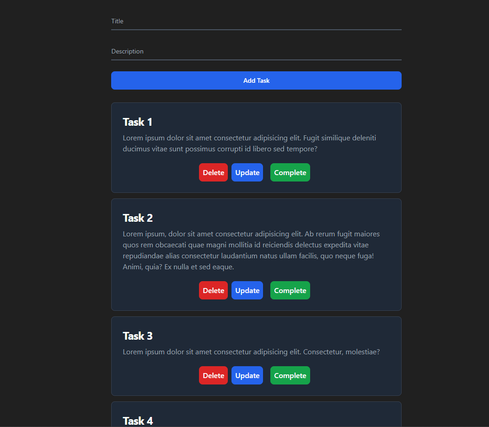

# Django TODO App with Tailwind CSS



## Overview

This is a simple TODO app built using Django, a high-level Python web framework, and styled with Tailwind CSS, a utility-first CSS framework. This project serves as a basic example of how to create a functional TODO application with a clean and responsive user interface.

## Features

- Create, read, update, and delete TODO tasks.
- Mark tasks as completed or uncompleted.
- Responsive design powered by Tailwind CSS.
- User-friendly interface with intuitive task management.

## Installation

Follow these steps to set up the project locally:

1. Clone the repository to your local machine:

   ```bash
   git clone https://github.com/sebastianmontandon/TODO-Django-Tailwind.git
   cd todo-app

2. Create a virtual environment and activate it:

   ```bash
   python -m venv venv
   source venv/bin/activate  # En Windows, usa `venv\Scripts\activate`

3. Install project dependencies:

   ```bash
   pip install -r requirements.txt

4. Run database migrations:

   ```bash
   python manage.py migrate

5. Create a superuser account to manage tasks:

   ```bash
   python manage.py createsuperuser

6. Start the development server:

   ```bash
   python manage.py runserver

7. Access the application in your web browser at `http://127.0.0.1:8000/`.

## Usage

1. Log in with the superuser account created in step 5 above.
2. Create, edit, and delete tasks using the web interface.
3. Mark tasks as completed or uncompleted by clicking the checkbox.
4. Log out when you're done.

## Contributing

Contributions are welcome! If you'd like to contribute to this project, please follow these guidelines:

1. Fork the repository.
2. Create a new branch for your feature or bug fix: `git checkout -b feature/your-feature-name`.
3. Commit your changes: `git commit -m "Add your feature description"`.
4. Push to your fork: `git push origin feature/your-feature-name`.
5. Create a pull request in the original repository.

## License

This project is licensed under the MIT License - see the [LICENSE](LICENSE) file for details.

## Acknowledgments

- [Django](https://www.djangoproject.com/) - The web framework used.
- [Tailwind CSS](https://tailwindcss.com/) - The CSS framework used for styling.
- [FontAwesome](https://fontawesome.com/) - Icons used for task status.
